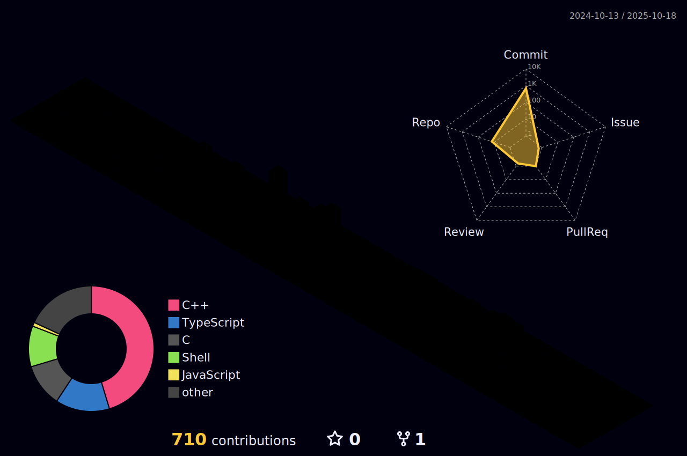

  

  
###  About Me
<!--  -->
<!-- ###   About Me 🌻 --> 
- 🏫 Student from École 42 Paris
- 👨‍🎓 Actively looking for Internship/Alternance opportunities in DevOps or Cloud
- 📋 Visit my portfolio at [My website](https://yichun-lin-portfolio.vercel.app) , and [My LinkedIn](https://www.linkedin.com/in/sophia-lin-profile/) !

###  GitHub Statistics

  <!-- -->
  
  
  

  
###  My Skills & Tools

#### Languages

#### Tools

<!-- Snake eating contributions -->
<!--  -->

 

<!-- 3D Contribution Skyline -->

<!-- GitHub Activity Graph -->
<!--  -->

 

<!-- Streak Stats with Fire Animation -->
<!--  -->

<!-- Snake Dark Mode -->

 

  

----------

## testing 

  

  

###  About Me

- 🏫 **Student at** [École 42 Paris](https://42.fr/en/homepage/)
- ☁️ **Focus:** System Administration, Automation, Infrastructure as Code.
- 👨‍🎓 **Goal:** Actively looking for **Internship / Alternance** opportunities in **DevOps** or **Cloud**.

  
  

---

###  My Tech Stack

#### 💻 Languages & Scripting

#### ☁️ DevOps & Cloud

#### ⚙️ CI/CD & Observability

 

###  GitHub Statistics

<table>
  <tr>
    <td>
      
    </td>
    <td>
      
    </td>
  </tr>
</table>

 

 

