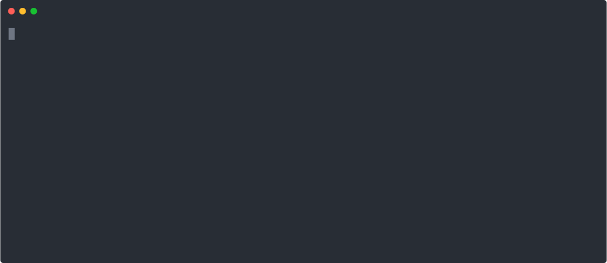

- 🏫 Student from École 42 Paris.
- 👨‍🎓 Actively looking for Internship/Alternance opportunities in DevOps or Cloud
<!--📋 Visit my portfolio at My website-->

<!--
https://carbon.now.sh/?bg=rgba%28171%2C+184%2C+195%2C+1%29&t=seti&wt=none&l=auto&width=680&ds=true&dsyoff=20px&dsblur=68px&wc=true&wa=true&pv=56px&ph=56px&ln=false&fl=1&fm=Hack&fs=14px&lh=133%25&si=false&es=2x&wm=false
-->

<!--
chunchun@github
-------------------------
OS: macOS Sequoia 15.3 arm64
Shell: zsh 5.8
Tools: Docker, Docker Compose, Kubernetes
Languages: C, C++, TypeScript, JavaScript, Bash
Currently: exploring DevOps & Cloud Infrastructure
Location: Paris, FR
-->

<!--

-->

<!--

<pre style="background-color:#282a36;color:#f8f8f2;font-family:'Fira Code', monospace;padding:15px;border-radius:10px;line-height:1.4em;">
chunchun@github
-------------------------
OS: macOS Sequoia 15.3 arm64
Shell: zsh 5.8
Tools: Docker, Docker Compose, Kubernetes
Languages: C, C++, TypeScript, JavaScript, Bash
Currently: exploring DevOps & Cloud Infrastructure
Location: Paris, FR
Discord: chunchun#1234
</pre>
-->

<!--

<!--
**ychun816/ychun816** is a ✨ _special_ ✨ repository because its `README.md` (this file) appears on your GitHub profile.

Here are some ideas to get you started:

- 🔭 I’m currently working on ...
- 👯 I’m looking to collaborate on ...
- 🤔 I’m looking for help with ...
- 💬 Ask me about ...
- 📫 How to reach me: ...
- 😄 Pronouns: ...
- ⚡ Fun fact: ...

c badge

 

### from tsunghao 

<h2 align="left">👋 Hi! My name is Tsunghao Chen</h2>

###

🏫 Studied at Ecole 42 Paris. 👨‍🎓 Actively looking for internship opportunities in DevOps or Cybersecurity 📋 Visit my portfolio at <a href="https://tsunghao.dev">My website</a>

###

  
  

###

-->
